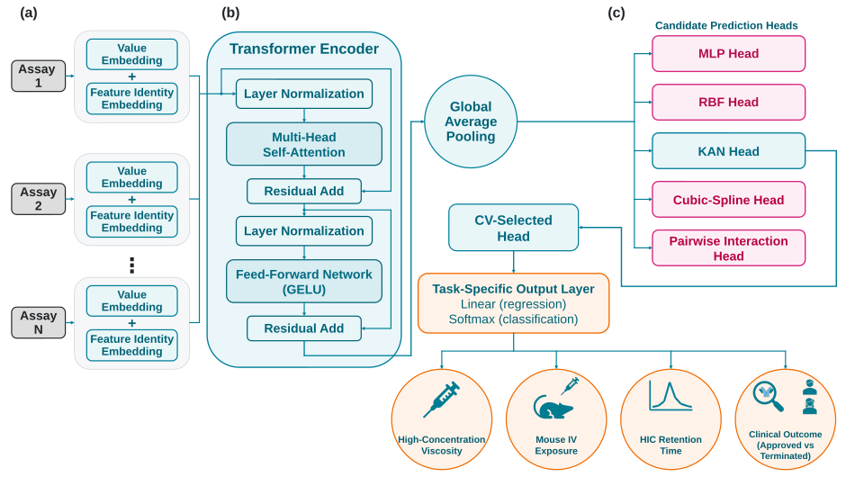
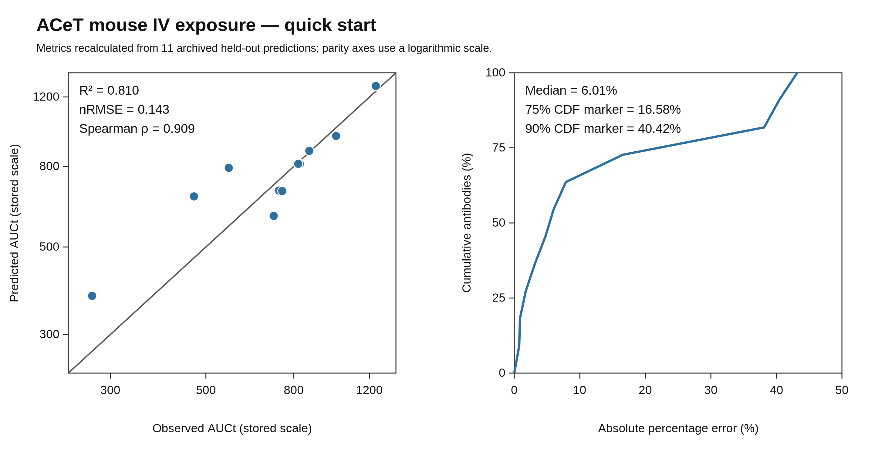

# ACeT — antibody developability from early assay panels

**An assay-integrated transformer framework for formulation, pharmacokinetic and clinical-outcome research.**

**Sabitoj Singh Virk · Akashdeep Singh Virk**

Companion data and software for **“Monoclonal Antibody Developability from Early Assay Panels: Machine Learning for Formulation and Pharmacokinetic Risk”**, *Machine Learning: Health*.

ACeT combines experimental assay values with learned feature identities, learns interactions between assays through self-attention, and couples the resulting representation to an endpoint-specific prediction head. This repository brings together the datasets, model implementations, archived predictions, benchmark analyses and figure sources for four applications: **high-concentration viscosity, mouse intravenous exposure, HIC retention time, and retrospective clinical-outcome classification**.

**[Datasets](Data/curated/) · [Quick demonstration](#quick-demonstration) · [Full training](#full-endpoint-training) · [All figures](#main-figure-guide) · [Supplementary analyses](#supplementary-figures-and-tables) · [Citation](CITATION.md)**



## Contents

1. [Results at a glance](#results-at-a-glance)
2. [Choose a workflow](#choose-a-workflow)
3. [Installation](#installation)
4. [Quick demonstration](#quick-demonstration)
5. [Datasets and feature order](#datasets-and-feature-order)
6. [How the architecture is implemented](#how-the-architecture-is-implemented)
7. [Full endpoint training](#full-endpoint-training)
8. [Feature selection and comparator tuning](#feature-selection-and-comparator-tuning)
9. [Main figure guide](#main-figure-guide)
10. [Supplementary figures and tables](#supplementary-figures-and-tables)
11. [Reproduction details and output management](#reproduction-details-and-output-management)
12. [Repository layout](#repository-layout)
13. [Citation and data attribution](#citation-and-data-attribution)

## Results at a glance

The table below describes the archived endpoint analyses. Commands later in this guide explain how to inspect the corresponding predictions, recreate the numerical summaries and start new training runs.

| Endpoint | Evaluation | Main archived result | Selected head |
|---|---|---|---|
| High-concentration viscosity | 52 development / 23 held-out antibodies | R² ≈ 0.741; RMSE ≈ 4.77 cP; MAE ≈ 3.08 cP | KAN |
| Mouse IV exposure | 42 development / 11 held-out antibodies | R² ≈ 0.810; nRMSE ≈ 0.143 | Cubic spline |
| HIC retention time, assays only | 152 antibodies; 10 repeats of fivefold OOF evaluation | Pearson r² ≈ 0.825; coefficient R² ≈ 0.796; RMSE ≈ 5.00 min | MLP |
| Clinical outcome, internal holdout | 89 internal training / 23 held-out antibodies | Balanced accuracy ≈ 0.785; approval sensitivity ≈ 0.769; termination specificity = 0.800 | MLP |
| Clinical outcome, temporally external | 14 antibodies; 2 Approved and 12 Terminated | Balanced accuracy ≈ 0.833 | The same internal-cohort MLP ensemble |

ACeT is trained separately for each endpoint. The common architecture supports different feature panels; it is not a single set of shared fitted weights for all four tasks. The clinical analysis is a retrospective classification of developability-linked outcomes, and mouse exposure is the AUC target rather than a directly measured clearance-rate prediction.

Additional experiments examine assay selection, representation pooling, feature importance, learning curves, augmentation, repeated training seeds, alternate data partitions and development-CV-tuned conventional comparators. The guide below groups these experiments by scientific question.

## Choose a workflow

| Goal | Starting command | What runs |
|---|---|---|
| See ACeT results immediately | `python acet.py demo` | Recalculate the 11-antibody mouse-exposure metrics and draw an SVG from archived predictions |
| Get PNG/JPG as well as SVG | `python acet.py demo --formats svg,png,jpg` | The same demonstration with raster exports |
| Check downloaded file integrity | `python acet.py verify --checksums-only` | Compare files with the release manifest; standard library only |
| Recalculate the archived scientific results | `python acet.py verify --report reruns/verification.json` | Numerical comparisons against stored regression, classification, HIC and sensitivity records |
| Train the main models | `python acet.py train all` | Fresh endpoint-specific neural-network fits in the training environment |
| Fit simple viscosity baselines | `python acet.py table-s4` | Two Ridge fits, not neural training |
| Refit tuned conventional models | `python acet.py comparator-cv` | Thirty locked model/fold combinations from the packaged development caches |
| Assemble supplementary plots | `python acet.py supplementary-figures` | MATLAB rendering of the archived sources for Figures S1–S11 |
| Collect table sources | `python acet.py export-tables` | Copies the numerical source records into folders labelled Table 1 and S1–S16 |

Use `python acet.py list` to see every top-level command and `python acet.py <command> --help` for its options. Commands are launched from the repository root, the directory containing `acet.py`. The default destination is a task-specific folder inside `reruns/`; an existing nonempty output directory is not overwritten.

## Installation

### Download or clone

Clone the repository or download and extract its ZIP:

```bash
git clone https://github.com/khalsa-singh/ACeT.git
cd ACeT
```

Keep the directory structure intact. No installation of ACeT as a system-wide Python package is required. Python commands below work in Windows PowerShell, macOS Terminal or a Linux shell once the intended Python environment is active.

### Lightweight analysis environment

The SVG demonstration and checksum-only check require only Python. For numerical verification, table reconstruction, cached classical-model fitting and PNG/JPG exports, use the analysis dependencies:

```bash
python -m venv .venv-analysis
```

Activate on Windows:

```powershell
.\.venv-analysis\Scripts\Activate.ps1
```

Or on macOS/Linux:

```bash
source .venv-analysis/bin/activate
```

Then install:

```bash
python -m pip install -r requirements.txt
python acet.py environment
```

`requirements.txt` is a lightweight analysis stack, separate from neural training. The raster demonstration uses Pillow and can optionally use CairoSVG. CairoSVG also needs the Cairo system library; the included Pillow renderer avoids that requirement for this demonstration. For only the image-export dependencies, use `requirements-demo.txt`.

### Neural-training environment

The recorded training configuration uses **Python 3.11 with TensorFlow/Keras 2.15, tfkan 0.1.0, scikit-learn 1.4.1.post1, SDV 1.17.4 and ImbalancedLearningRegression 0.0.2**, together with the numerical and plotting packages listed in `requirements-training.txt`.

On Windows, create a separate training environment using a Python 3.11 installation:

```powershell
py -3.11 -m venv .venv-training
.\.venv-training\Scripts\Activate.ps1
python -m pip install -r requirements-training.txt
python acet.py environment
```

On macOS/Linux, use `python3.11 -m venv .venv-training`, then activate that environment and install the same requirements. TensorFlow installation and GPU support depend on the operating system; a CPU environment can also execute the workflows. This file records the study stack; it is not intended for Python 3.13 or for installation over an existing modern TensorFlow environment.

Neural-training commands perform actual model fits, normally five folds per selected head with up to 1,000 epochs and early stopping. HIC uses 50 folds per feature configuration. Runtime depends on hardware and early stopping; the archived-results workflows are the faster starting point.

### MATLAB figure rendering

The publication-style MATLAB producers were developed with MATLAB R2022b. Put `matlab` on the system PATH to use the top-level MATLAB commands, or open MATLAB in the repository root and use the calls shown below. Existing EPS, SVG, PDF and PNG figure exports can be inspected without MATLAB.

## Quick demonstration

Run:

```bash
python acet.py demo
```

The demonstration reads the archived Figure 3a prediction table, recalculates error metrics, and writes:

```text
reruns/demo/
    clearance_demo_metrics.json
    clearance_demo_parity_and_cdf.svg
```

To obtain high-resolution PNG and JPG copies in the same run:

```bash
python acet.py demo --formats svg,png,jpg --output-dir reruns/demo_images
```

The SVG remains the vector master. Raster output is 2940 × 1500 pixels. The demonstration gives approximately R² = 0.810019, nRMSE = 0.143226 and Spearman ρ = 0.909091. Its error-CDF reference markers are 6.01%, 16.58% and 40.42%, using the article's ordered-error convention.



The demonstration recalculates existing predictions; it does not require trained weights. To produce new predictions by fitting ACeT, use `python acet.py train mouse_exposure` in the training environment. [The demo guide](Demo/README.md) links directly to those larger workflows and explains the output units.

## Datasets and feature order

### Canonical data

All five curated datasets can be browsed directly under **[Data/curated](Data/curated/)**. The repository maintains one canonical full table per dataset:

| File | Rows | Role |
|---|---:|---|
| `DataS1_viscosity_seed0_full.csv` | 75 | Four assay measurements, viscosity and the fixed development/test allocation |
| `DataS2_clearance_seed0_full.csv` | 53 | Four clearance-related assay measurements, stored AUCt and the fixed allocation |
| `DataS3_clinical_internal_112_seed0_full_wname.csv` | 112 | Internal outcome-locked cohort, names, five assays and outcome labels |
| `DataS4_clinical_external_14_full_wname.csv` | 14 | Temporally external cohort with resolved outcomes |
| `DataS5_bailly2020_hicrt_no_leakage_all_features.csv` | 152 | HIC target, assay features, surface-patch descriptors and identifiers |

[Data/DATA_DICTIONARY.csv](Data/DATA_DICTIONARY.csv) describes the measurements and units. [Data/SOURCES.md](Data/SOURCES.md) identifies the published datasets and the author-curated derivative tables. Fixed regression splits are under `Data/fixed_splits/`; the main clinical numeric input files are under `MainPack/clinical_outcome/code/source/shared/`.

### Model input schemas

For the main regression runners, use the supplied numeric-only files rather than passing identifier columns as features:

- **Viscosity:** `DLS Interaction Parameter kD (mL/g)`, `SE-UHPLC Main Peak Plates (EP)`, `AC-SINS λmax (nm)`, `SE-UHPLC Main Peak FWHM (min)`; final target column `Viscosity`.
- **Mouse exposure:** `Heparin_RT`, `Heparin_pB_buffer`, `BVP_high`, `poly_D_lysine`; final target `AUCt`.
- **Clinical outcome:** `AS`, `PSR`, `ACSINS`, `ELISA`, `BVP`; final target `Outcome`, or `Updated.Status` for the external file.
- **HIC:** the runner explicitly removes `mab_id` and selects `hic_rt_min` as the target. `--hic-features` controls the assay/patch configuration.

The legacy viscosity header `AC-SINS λmax (nm)` denotes the spectral-shift measurement described as Δλmax in the article. Some external clinical source headers contain trailing whitespace; the numeric model-input files already provide aligned feature names. Keep the supplied order because learned feature identities correspond to column positions.

### Mouse-exposure units

The numeric modeling tables store AUC0–672h divided by 10⁴. Divide a stored value by **100** to express it in the 10⁶ ng·h/mL units used in the manuscript's plotted axes. For example, stored AUCt = 800 represents 8 × 10⁶ ng·h/mL. nRMSE and nMAE divide RMSE and MAE by the mean observed AUCt in the evaluated cohort.

The main imputed mouse-exposure dataset and the development-only feature-selection dataset are separate analyses with separate input panels. The latter uses an SEC-LMW stability readout in place of poly-D-lysine and supplies its own numeric inputs under `SensitivityAnalyses/DevelopmentOnlyFeatureSelection/mouse_exposure/data/`.

## How the architecture is implemented

Each scalar assay measurement passes through a value projection. A learned feature-identity embedding is added to form one token per assay. A pre-normalization encoder processes the assay-token sequence using self-attention and a feed-forward network, each with a residual connection. Global-average pooling produces the endpoint representation, which feeds one candidate readout head and a linear regression or two-class softmax output.

The model modules implement five heads: **MLP, RBF, KAN, cubic spline and pairwise interaction**. They are evaluated as alternatives, not as five simultaneous branches of a single fitted network. KAN is highlighted illustratively in Figure 1; the selected head depends on the endpoint.

The main model defaults use a 16-dimensional embedding, two attention heads, a 32-unit feed-forward layer, one encoder block and a 64-unit readout width. The development-only mouse-exposure run uses 32-dimensional embeddings and a 48-unit feed-forward layer; its exact configuration is recorded in `SensitivityAnalyses/DevelopmentOnlyFeatureSelection/mouse_exposure/analysis_settings.json`.

| Module | Location |
|---|---|
| Viscosity encoder and heads | `MainPack/viscosity/code/source/shared/viscosity_model.py` |
| Mouse-exposure encoder and heads | `MainPack/mouse_exposure/code/source/shared/clearance_model.py` |
| Clinical encoder and heads | `MainPack/clinical_outcome/code/source/figure4_targeted/clinical_model.py` |
| HIC encoder and heads | `GenBench/hic_benchmark/code/source/shared/bailly_hic_model.py` |

The learned weights change during training; embedding dimensions, layer widths, number of heads and number of blocks are configuration hyperparameters. [Reproducibility/README.md](Reproducibility/README.md) describes preprocessing order, ensemble construction and the meaning of the different evaluation records.

## Full endpoint training

### Check inputs before fitting

These checks validate dimensions, feature order, outcome encoding, source paths and command-line options without importing TensorFlow:

```bash
python acet.py train all --check-inputs
python acet.py train all --analysis feature-selection --check-inputs
```

Each training call uses the endpoint's recorded head by default, writes into a new output directory, and saves the command/configuration plus `training.log`. Activate the training environment before omitting `--check-inputs`.

### Viscosity

```bash
python acet.py train viscosity --output-dir reruns/viscosity_main
```

This invokes `panel_A_D_parity_featureimp.py` with the numeric 52/23 inputs and `--head_type kan`. It fits the Gaussian-Copula augmentation and five fold models, then writes predictions, MAT variables and plots. The article's Figure 2a result is archived in `MainPack/viscosity/results/primary/viscosity_results.mat`; compare newly generated output to that record rather than overwriting it.

For the dedicated importance, feature-ablation and learning-curve experiment:

```bash
python acet.py figure2de-preflight --output-dir reruns/figure2de_inputs
python acet.py figure2de-train --output-dir reruns/figure2de_training
```

This experiment fixes KAN, evaluates five training seeds, uses ten permutations per feature, and runs the specified reduced panels and nested development subsets. The saved `learning_subset_order_seed0.csv` provides the fixed subset order. Its archived outputs include per-antibody predictions, permutation repeats, seed summaries, paired tests, ablation results and learning-curve membership.

### Mouse intravenous exposure

```bash
python acet.py train mouse_exposure --output-dir reruns/mouse_exposure_main
```

The selected spline head is trained on the 42/11 numeric main-analysis files by `panel_A_B_parity.py`. The source contains the endpoint's augmentation and resampling order. The principal reference is `MainPack/mouse_exposure/results/primary/clearance_panel3A_data.mat`.

For a new SHAP calculation, run the source script in a separate output directory using the same full input paths and `--head_type spline`:

```text
MainPack/mouse_exposure/code/source/shared/panel_D_shap.py
```

That script trains models and computes SHAP; it is not a lightweight plotting-only command. The article's archived SHAP tensor is `MainPack/mouse_exposure/results/figure3d/clearance_shap_summary.mat`, and `python acet.py figure3-plots` renders the stored Figure 3 panels in MATLAB.

### Clinical outcome

```bash
python acet.py train clinical_outcome --output-dir reruns/clinical_main
```

This uses the numeric 89-row development set, 23-row holdout and 14-row external cohort. It invokes the instrumented `panels.py` under `code/source/figure4_targeted/`, which writes fold assignments, CV metrics, histories, probabilities and classification outputs. The default MLP evaluation uses five models and two-class softmax decisions.

For fast reconstruction from archived probabilities instead:

```bash
python acet.py clinical-results --output-dir reruns/clinical_tables
```

The postprocessor calculates confusion counts, diagnostic metrics, raw-assay threshold comparisons and the illustrative portfolio values. Its execution record specifies its bootstrap seed; the article's Table S11 interval source is retained independently under `GenBench/diagnostics/clinical_uncertainty/`.

### HIC retention time

The following commands run the three feature configurations separately, each with 10 repeats of fivefold OOF evaluation:

```bash
python acet.py train hic --hic-features assays_only --output-dir reruns/hic_assays
python acet.py train hic --hic-features patch_only --output-dir reruns/hic_patch
python acet.py train hic --hic-features all --output-dir reruns/hic_assays_and_patch
```

The wrapper supplies the ID and target columns explicitly. The source uses fold-local preprocessing and generates ACeT and fold-matched Bailly-refit predictions, continuous metrics and 30-minute triage metrics. Out-of-fold predictions are averaged per antibody across the repeated CV runs.

To recreate plots and summaries from the archived OOF predictions without neural training:

```bash
python acet.py hic-results --output-dir reruns/hic_figures_and_tables
```

This generates parity and confusion plots, aggregate performance summaries and repeat-level variability records. Keep **coefficient R²** distinct from **squared Pearson correlation r²**. The recorded 50-minute values are assay-ceiling observations; the continuous and 30-minute triage analyses are both provided.

### Train all main endpoints

```bash
python acet.py train all --output-dir reruns/all_main_endpoints
```

This runs viscosity, mouse exposure, clinical outcome and assays-only HIC in separate subfolders. Use the two additional HIC commands above for patch-only and combined features. `--epochs` and `--seed` permit separate experiments; changing them produces a new experiment rather than replacing the archived article result. To benchmark head alternatives, `--head all` launches one independent source run per head and preserves each output separately; use the development-CV records for model choice.

## Feature selection and comparator tuning

### Matched regression comparators and mouse-exposure SHAP

To refit the full matched main-regression comparisons (ACeT plus prespecified Ridge, SVR and random forest):

```bash
python acet.py train viscosity --analysis matched-comparison --check-inputs
python acet.py train viscosity --analysis matched-comparison --output-dir reruns/matched_viscosity
python acet.py train mouse_exposure --analysis matched-comparison --output-dir reruns/matched_mouse
```

These commands use the original matched preprocessing and model implementations, not the tuned S16 parameter search. They require the neural-training environment because the comparator source also fits ACeT. The numeric plotting sources for Figure 2c/3c are retained separately in `FigureSources/`.

For a new mouse-exposure fit with KernelSHAP analysis, use:

```bash
python acet.py train mouse_exposure --analysis shap --check-inputs
python acet.py train mouse_exposure --analysis shap --output-dir reruns/mouse_shap
```

The source performs model fitting before SHAP. The archived Figure 3d SHAP matrix is available without retraining under `MainPack/mouse_exposure/results/figure3d/`.

### Development-only feature selection — Table S15

`SensitivityAnalyses/DevelopmentOnlyFeatureSelection/` contains the defined candidate sets, development membership maps, source inputs, rankings, model-ready data and result records.

```bash
python acet.py viscosity-screen --output-dir reruns/viscosity_candidate_screen
python acet.py mouse-preprocessing --output-dir reruns/mouse_feature_preprocessing
```

The viscosity command ranks the explicitly defined candidate set by absolute Pearson association with development viscosity. Candidate definitions and the reference ranking remain in the `reference/` folder. The four leading assays within this set are FWHM, kD, plate count and AC-SINS; the model input column order remains the order expected by the archived training implementation.

The mouse-exposure command applies development-derived outlier screening, chained-equations imputation and Pearson ranking, followed by the second selected-panel preprocessing stage. It regenerates the 42-row training matrix and exports the raw 11-antibody selected-panel holdout unchanged. Development AUC is an auxiliary variable in Stage 1 only; it is not used to impute the held-out table.

Train the recorded sensitivity configurations with:

```bash
python acet.py train viscosity --analysis feature-selection --output-dir reruns/viscosity_feature_selection
python acet.py train mouse_exposure --analysis feature-selection --output-dir reruns/mouse_feature_selection
```

The viscosity configuration uses KAN; the mouse-exposure configuration uses the development-CV-selected MLP. The latter's archived held-out result is R² ≈ 0.667, nRMSE ≈ 0.190 and Spearman ρ ≈ 0.827. Its 63 synthetic observations and 32/48 embedding/feed-forward dimensions are recorded with the analysis rather than conflated with the main mouse-exposure configuration.

### Development-CV-tuned comparators — Table S16

`SensitivityAnalyses/TunedComparatorStressTest/` includes numeric data, 30 cached fold matrices, the full 3,380-trial ledger, selected parameter settings, CV scores and per-antibody holdout predictions.

```bash
python acet.py comparator-cv --output-dir reruns/comparator_refits
```

This refits Ridge, RBF-SVR and random forest with their locked settings on the packaged development folds. Each family was tuned independently for each endpoint: 1,320 Ridge, 220 SVR and 150 random-forest configurations per endpoint. The parameter lock and fold-cache fingerprints are separately verified in addition to the root manifest.

To repeat the preprocessing, finite search and held-out evaluation in the study environment:

```bash
python acet.py comparator-preflight --output-dir reruns/comparator_preflight
python acet.py comparator-search --output-dir reruns/comparator_search
python acet.py comparator-heldout --output-dir reruns/comparator_holdout
```

The defaults use the archived fold caches and, for held-out evaluation, the archived lock. A new cache can be selected with `--cache-dir`, and a new search's parameter directory with `--lock-dir`. The fixed-control preflight includes its own evaluation; the hyperparameter search itself uses development data, with tuned-model evaluation following parameter locking.

The article compares all completed model families. The highest held-out tuned comparator is Ridge for viscosity (R² ≈ 0.529) and SVR for mouse exposure (R² ≈ 0.731), versus the matched ACeT values ≈ 0.741 and ≈ 0.791. These are finite, recorded model-family comparisons; the full ledger allows inspection beyond the selected rows.

## Main figure guide

### Figure 1 — architecture

`FigureSources/main/Figure_1/` contains the editable PowerPoint, vector SVG/PDF/EPS and matching caption. The flat schematic depicts the common token/encoder/readout design and all four applications. Use the live-text PowerPoint to edit the diagram and vector exports for manuscript placement.

### Figure 2 — viscosity

| Panel | Content | Source or command |
|---|---|---|
| 2a | Held-out parity | `MainPack/viscosity/results/primary/viscosity_results.mat`; full training: `acet.py train viscosity` |
| 2b | Low/intermediate/high viscosity bootstrap summaries | `acet.py figure2b-data`; source predictions and bootstrap samples under `FigureSources/main/Figure_2/panel_b/data/` |
| 2c | Matched reference-model comparison | `acet.py figure2c-tables`; archived fold/test data under `FigureSources/main/Figure_2/panel_c/data/` |
| 2d | Permutation importance and paired comparisons | `MainPack/viscosity/results/figure2de/figure2d_*`; training: `acet.py figure2de-train` |
| 2e | Nested learning curve and feature ablations | `MainPack/viscosity/results/figure2de/figure2e_*`; the same dedicated training experiment |

```bash
python acet.py figure2b-data --output-dir reruns/figure2b_data
python acet.py figure2c-tables --output-dir reruns/figure2c_data
python acet.py figure2de-plots --output-dir reruns/figure2de_plots
```

The last command uses MATLAB. The manuscript EPS set in `FigureSources/Publication_EPS/` includes the transparency-consistent exports for 2a and 2b; the archived numeric plotting sources are unchanged.

### Figure 3 — mouse exposure

| Panel | Content | Source or command |
|---|---|---|
| 3a | Main parity and percentage-error CDF | `clearance_panel3A_data.mat` and `FigureSources/main/Figure_3/panel_a/data/`; quick metrics via the demo |
| 3b | Augmented versus unaugmented comparison | `MainPack/mouse_exposure/results/figure3b/`; `acet.py figure3b-data` extracts the retained paired arrays |
| 3c | Matched conventional references | `FigureSources/main/Figure_3/panel_c/data/` |
| 3d | SHAP effects and feature ordering | `MainPack/mouse_exposure/results/figure3d/clearance_shap_summary.mat` |

```bash
python acet.py figure3b-data --output-dir reruns/figure3b_arrays
python acet.py figure3-plots --output-dir reruns/figure3_plots
```

The augmented-arm producer and CV records for 3b are supplied. The retained paired arrays support exact plot-level reconstruction of both arms; the archive does not contain the unaugmented arm's complete original head-selection log. The main 3a, matched 3c and augmentation-comparison results are separate recorded experiments.

### Figure 4 and Table 1 — clinical classification and portfolio context

Clinical `results/targeted_repro/` holds probabilities, confusion matrices, thresholds, fold metrics, training histories and economic calculations. `results/finalization/` holds the Table S14 rule comparisons. Figure 4's composite numerical source is `FigureSources/main/Figure_4/data/Figure4_FINAL_source.mat`.

```bash
python acet.py clinical-results --output-dir reruns/clinical_results
python acet.py figure4 --output-dir reruns/figure4
```

The second command renders the composite in MATLAB. Panels 4a–d respectively show training/test confusion matrices, published versus training-derived thresholds, illustrative portfolio cell values, and portfolio totals. The internal portfolio uses a 12% success prior for 23 programs; the external portfolio uses the observed two Approved and twelve Terminated outcomes. Dollar values are the stated illustrative assumptions, not measured financial returns.

## Supplementary figures and tables

### Render Figures S1–S11

```bash
python acet.py supplementary-figures --output-dir reruns/supplementary_figures
```

Or inside MATLAB, with the current directory at the repository root:

```matlab
addpath(fullfile(pwd,'FigureSources','supplementary','code'));
generate_all_supplementary_figures(pwd, fullfile(pwd,'reruns','supplementary_figures'));
```

The renderer writes the figure files to the requested output directory. It uses the preserved sources rather than fitting models. Existing publication renditions are organized as `FigureSources/supplementary/Figure_S01/` through `Figure_S11/`.

| Figure | Analysis | Stored source |
|---|---|---|
| S1 | Viscosity error CDF, fixed holdout and alternate partitions | Fixed-holdout predictions plus alternate-partition viscosity predictions under `GenBench/robustness/` |
| S2 | Viscosity parity in the same two designs | The same prediction-level records |
| S3 | Mouse-exposure error CDF in the two designs | Fixed-holdout and alternate-partition mouse-exposure predictions |
| S4 | Mouse-exposure parity | The same mouse-exposure records |
| S5 | Clinical external-cohort stability across internal split seeds | Stored component panels under `FigureSources/supplementary/source_data/clinical_s5/`, with aggregate results under `GenBench/robustness/clinical_external/` |
| S6 | Assays-only HIC bagged OOF parity | HIC assays-only OOF CSV |
| S7 | Patch-only ACeT and fold-matched Bailly parity | HIC patch-only OOF CSV, including both models |
| S8 | HIC triage confusion matrices | Assays-only and patch-only OOF CSVs; the same Bailly refit is intentionally shown twice for comparison |
| S9 | SEC peak-shape versus viscosity | Canonical DataS1 |
| S10 | Copula distribution, correlation and neighborhood diagnostics | `GenBench/diagnostics/gaussian_copula/results/` |
| S11 | Regression training and validation histories | `GenBench/diagnostics/pooling_sensitivity/results/*_full_training_history.csv` |

S5 is assembled from its saved panel images and aggregate repeated-evaluation records; it is not regenerated from a complete set of repeated classifier checkpoints. S1–S4 use individual predictions, and S6–S11 use numerical inputs or saved histories as listed.

### Refit the supporting robustness and diagnostic experiments

```bash
python acet.py fixed-holdout-preflight --output-dir reruns/fixed_inputs
python acet.py split-sensitivity-preflight --output-dir reruns/split_inputs
python acet.py fixed-holdout-train --output-dir reruns/fixed_training
python acet.py split-sensitivity-train --output-dir reruns/split_training
python acet.py pooling-viscosity --output-dir reruns/viscosity_pooling
python acet.py pooling-mouse-exposure --output-dir reruns/mouse_pooling
python acet.py gaussian-copula --output-dir reruns/copula_diagnostics
```

The preflight commands validate paths and partitions. The training commands require the training stack; the copula command needs SDV and the analysis stack, not a neural-network fit. Fixed-holdout stability varies training seeds on an unchanged test set, whereas alternate-partition sensitivity varies the test membership. The final S13 summary keeps those two questions separate. The combined alternate-partition prediction files are required inputs for S1–S4 and are retained under explicit names.

### Collect Table 1 and Tables S1–S16

```bash
python acet.py export-tables --output-dir reruns/table_sources
```

This creates table-labelled folders with the actual CSV/JSON/MAT sources and an index identifying their roles. It is a source-data export, not a recreation of Word table formatting. The following guide covers every supplementary table:

| Table | What it contains | Principal source |
|---|---|---|
| S1 | Data dictionary and assay/output units | `Data/DATA_DICTIONARY.csv` |
| S2 | Bagged HIC OOF continuous and triage performance | HIC aggregate JSONs and benchmark summary; `acet.py hic-results` |
| S3 | HIC repeat-level variability | HIC `*_repeat_metrics.csv` files |
| S4 | Single-descriptor viscosity Ridge baselines | `Reproducibility/Table_S4/`; `acet.py table-s4` performs the two fits |
| S5 | Fold-matched main regression comparisons | `Reproducibility/table_sources/` and the Figure 2c/3c MAT sources |
| S6 | Reference-estimator settings | `MainPack/shared/minimal_baseline_patch/` sources |
| S7 | Prediction-head comparison | `GenBench/diagnostics/prediction_head_comparison/` plus endpoint results |
| S8 | Preprocessing, augmentation and training settings | Endpoint source modules, training requirements and sensitivity configuration JSON |
| S9 | Representation-aggregation sensitivity | Pooling `*_full_metrics.csv` and predictions |
| S10 | Copula numerical diagnostics | Copula summary, correlations, marginal and neighbor statistics |
| S11 | Clinical uncertainty intervals | `GenBench/diagnostics/clinical_uncertainty/clinical_uncertainty_table.csv` |
| S12 | HIC benchmark, triage and censoring context | HIC benchmark summary and censoring note |
| S13 | Fixed-holdout, alternate-partition, clinical and HIC repeat summaries | `GenBench/robustness/` sources and HIC repeat tables |
| S14 | Published and training-derived clinical assay rules | `MainPack/clinical_outcome/results/finalization/TABLE_S14_CLINICAL_RULE_COMPARISON.csv` |
| S15 | Development-only assay ranking and selected-panel performance | `SensitivityAnalyses/TableSources/Table_S15*.csv` |
| S16 | Development-CV-tuned conventional benchmarks and locked parameters | `SensitivityAnalyses/TableSources/Table_S16*.csv` and tuning records |

The final table source files retain their recorded precision. Population-SD summaries and sample-SD summaries are distinguished in their generating scripts; rounded publication values should be interpreted at the displayed precision.

## Reproduction details and output management

There are three complementary operations: **recalculate an archived result**, **refit a recorded model configuration**, and **run a new experiment**. The command names and descriptions above identify which one is performed. Archived result files are the comparison references. New work belongs under `reruns/`, so the original predictions, inputs and figure sources stay available for checking.

The regression implementations preserve the documented native-row weighting, Gaussian-Copula augmentation, transformations and resampling order. Their internal CV is used for head selection and ensemble construction. The held-out and OOF predictions, fixed-panel comparisons and additional sensitivity results each retain their own source labels. Details such as averaging fold predictions in transformed-target space are documented in [Reproducibility/README.md](Reproducibility/README.md).

The repository supplies training code and archived predictions; it does not ship pretrained model checkpoints. Neural training can vary with software versions, device kernels and random-state behavior. Use `requirements-training.txt` and record the resulting environment when comparing a new fit. The analysis environment is sufficient for checking archived metrics and fitting cached conventional models, without installing the full neural stack.

### Checksums and intentional edits

`MANIFEST.csv` and `CHECKSUMS.sha256` at the root describe the public release. Re-run this after intentionally changing, adding, deleting or renaming a tracked file:

```bash
python tools/update_manifest.py
python tools/update_manifest.py --check
python acet.py verify --checksums-only
```

The command updates both indexes together and excludes `.git`, virtual environments, Python caches and generated `reruns/` directories. Generating a new demonstration or training run therefore does not require refreshing the release manifest. The parameter-lock checksum and fold-cache fingerprints are analytical records: they remain unchanged unless those particular settings or caches are deliberately replaced by a new experiment. Keep a new experiment's evidence in its own output directory.

The external checksum accompanying a downloaded release ZIP applies to that ZIP. A newly compressed ZIP needs a newly calculated external checksum, even when its extracted contents are identical. Review unexpected file changes before refreshing the integrity indexes.

### Troubleshooting

**A dependency is missing:** activate the appropriate environment and run `python acet.py environment`. Lightweight verification and full neural training intentionally use different installation lists.

**`mean_squared_error(..., squared=False)` raises an error:** the recorded training code expects scikit-learn 1.4.1.post1. Use the training environment rather than modifying the estimator or metric implementation midway through a reproduction.

**A data-column error occurs:** use the supplied numeric inputs or the top-level training wrapper. Canonical full tables include identifiers and split labels, which must not be passed as model predictors.

**The output directory already exists:** choose a new `--output-dir`, or archive the previous run before making an empty directory. Public reference results are never the destination for new fits.

**Raster export cannot load Cairo:** the standard-library SVG path still works. Install Cairo/CairoSVG appropriately for the platform, or use the supplied Pillow-based raster fallback described in the demo guide.

**MATLAB is not installed:** browse the included figure exports and use Python numerical workflows. The MATLAB commands are plotting entry points, not prerequisites for the data or quick demonstration.

## Repository layout

```text
ACeT/
├── README.md                       # This end-to-end guide
├── CITATION.cff                    # Machine-readable software and preferred paper citation
├── CITATION.md                     # Human-readable paper/software citation guidance
├── acet.py                         # Unified workflow launcher
├── requirements*.txt               # Separate analysis, demo and training environments
├── Data/                           # Canonical datasets, dictionary and fixed splits
├── Demo/                           # Mouse-exposure quick start and example exports
├── MainPack/                       # Main viscosity, exposure and clinical workflows
├── GenBench/                       # HIC benchmark, robustness and diagnostics
├── SensitivityAnalyses/             # Feature-selection and comparator-tuning analyses
├── FigureSources/                   # Editable schematic and manuscript/supplement sources
├── Reproducibility/                 # Methods, environments and numerical table sources
├── tools/                          # Training launcher, table exporter, integrity utility
├── MANIFEST.csv
└── CHECKSUMS.sha256
```

The top-level guide is the starting point; short local READMEs explain each directory's files. Numerical `R2`/`r2` labels in CSVs or code denote the coefficient of determination.

## Citation and data attribution

Please cite the accompanying article when discussing ACeT's methods or scientific results:

**Sabitoj Singh Virk and Akashdeep Singh Virk. “Monoclonal Antibody Developability from Early Assay Panels: Machine Learning for Formulation and Pharmacokinetic Risk.” *Machine Learning: Health*.**

When reusing the implementation or data package, also identify **ACeT — antibody developability data and software**, its release/commit, and the repository URL. [CITATION.md](CITATION.md) distinguishes these references; the standard [CITATION.cff](CITATION.cff) contains software metadata and the paper as the preferred citation. Article and software DOIs, when available, are distinct identifiers.

The underlying measurements come from the cited Mock, Liu, Bailly and Jain studies. See [Data/SOURCES.md](Data/SOURCES.md) and [RIGHTS_AND_ATTRIBUTION.md](RIGHTS_AND_ATTRIBUTION.md). Contact: **sabitoj@umich.edu**. Repository: **https://github.com/khalsa-singh/ACeT**.
